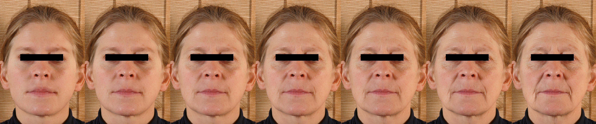
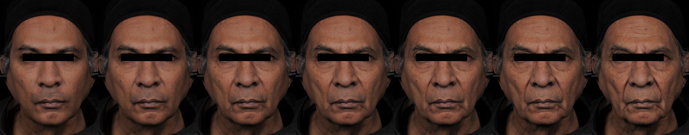

    <h2 style="width:33%; margin: 0 auto"><a href="https://www.linkedin.com/in/juliendespois/">Julien Despois</a></h2>
    <h2 style="width:33%; margin: 0 auto"><a href="https://www.linkedin.com/in/frederic-flament-ph-d-b8aa212/">Frederic Flament</a></h2>
    <h2 style="width:33%; margin: 0 auto"><a href="https://www.linkedin.com/in/matthieu-perrot-225ab01b/">Matthieu Perrot</a></h2>

## Video Summary

TODO

## Abstract
Existing approaches and datasets for face aging produce results skewed towards the mean, with individual variations and expression wrinkles often invisible or overlooked in favor of global patterns such as the fattening of the face. Moreover, they over little to no control over the way the faces are aged and can difficultly be scaled to large images, thus preventing their usage in many real-world applications. To address these limitations, we present an approach to change the appearance of a high-resolution image using ethnicity-specific aging information and weak spatial supervision to guide the aging process. We demonstrate the advantage of our proposed method in terms of quality, control, and how it can be used on high-definition images while limiting the computational overhead.

## Model

## Training

## Results

TODO Videos

We recommend viewing the video in full-screen to see the resolution of the image our model can handle.

    <video style="margin: 0 auto; width: 49%" controls>
      <source src="img/cau.mov">
    Your browser does not support the video tag.
    </video>
    <video style="margin: 0 auto; width: 49%" controls>
      <source src="img/chi.mov">
    Your browser does not support the video tag.
    </video>

### Supervised: High-Resolution Standardized Dataset

### Weakly-Supervised: FFHQ

### Paper & Supplementary Materials
TODO 1 | TODO 2