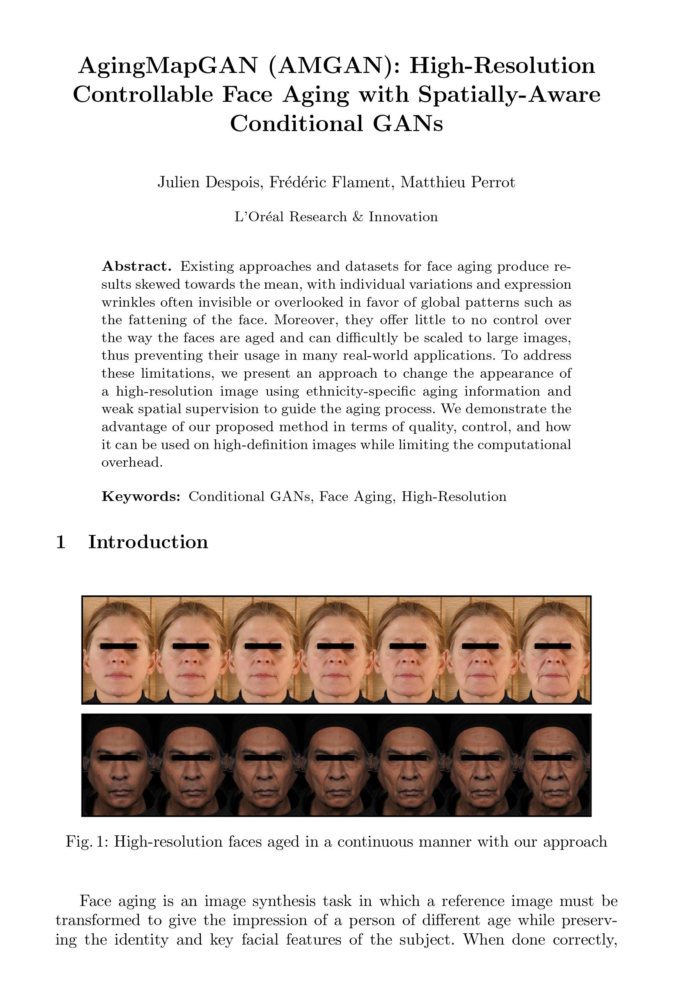

## AgingMapGAN (AMGAN): High-Resolution Controllable Face Aging with Spatially-Aware Conditional GANs

    <h2><a style="width: 30%;margin: 5%;" href="https://www.linkedin.com/in/juliendespois/" target="_blank">Julien Despois</a><a style="width: 30%;margin: 5%;" href="https://www.linkedin.com/in/frederic-flament-ph-d-b8aa212/" target="_blank">Frederic Flament</a><a style="width: 30%;margin: 5%;" href="https://www.linkedin.com/in/matthieu-perrot-225ab01b/" target="_blank">Matthieu Perrot</a></h2>

  

## Video Summary
<iframe style="display: block; margin: auto;" width="840" height="472.5" src="https://www.youtube.com/embed/HMZiSVKXkWo" frameborder="0" allow="encrypted-media; picture-in-picture" allowfullscreen></iframe>

## Abstract
Existing approaches and datasets for face aging produce results skewed towards the mean, with individual variations and expression wrinkles often invisible or overlooked in favor of global patterns such as the fattening of the face. Moreover, they offer little to no control over the way the faces are aged and can difficultly be scaled to large images, thus preventing their usage in many real-world applications. To address these limitations, we present an approach to change the appearance of a high-resolution image using ethnicity-specific aging information and weak spatial supervision to guide the aging process. We demonstrate the advantage of our proposed method in terms of quality, control, and how it can be used on high-definition images while limiting the computational overhead.

## Model

  

## Training

  

## Results
We recommend viewing the videos in full-screen to see the generated HD images (1024px).

    <video style="margin: 0 auto; width: 49%" controls>
      <source src="img/cau.mov">
    Your browser does not support the video tag.
    </video>
    <video style="margin: 0 auto; width: 49%" controls>
      <source src="img/ind.mov">
    Your browser does not support the video tag.
    </video>
    <video style="margin: 0 auto; width: 49%" controls>
      <source src="img/aam.mov">
    Your browser does not support the video tag.
    </video>
    <video style="margin: 0 auto; width: 49%" controls>
      <source src="img/chi.mov">
    Your browser does not support the video tag.
    </video>

### Supervised: High-Resolution Standardized Dataset
We recommend opening the images in a new tab to see the details.

  

  

### Weakly-Supervised: FFHQ
We recommend opening the images in a new tab to see the details.

  
  

  
  

  
  

### Paper & Supplementary Materials
TBA: Waiting for ECCV 2020 Proceedings

<table align="center">      
    <tbody>
    <tr>
        <td>
            
        </td>
        <td>J. Despois, F. Flament, M. Perrot 
            <b>AgingMapGAN (AMGAN): High-Resolution Controllable Face Aging with Spatially-Aware Conditional GANs.</b> 
            In ECCV, 2020 (AIM Workshop).
            <a href="TODO">arXiv</a>
        </td>
    </tr>
    </tbody>
</table>

### Other works
Check out our other paper presented at AIM (ECCV 2020): <a href="https://robinkips.github.io/CA-GAN/" target="_blank">https://robinkips.github.io/CA-GAN/</a>
